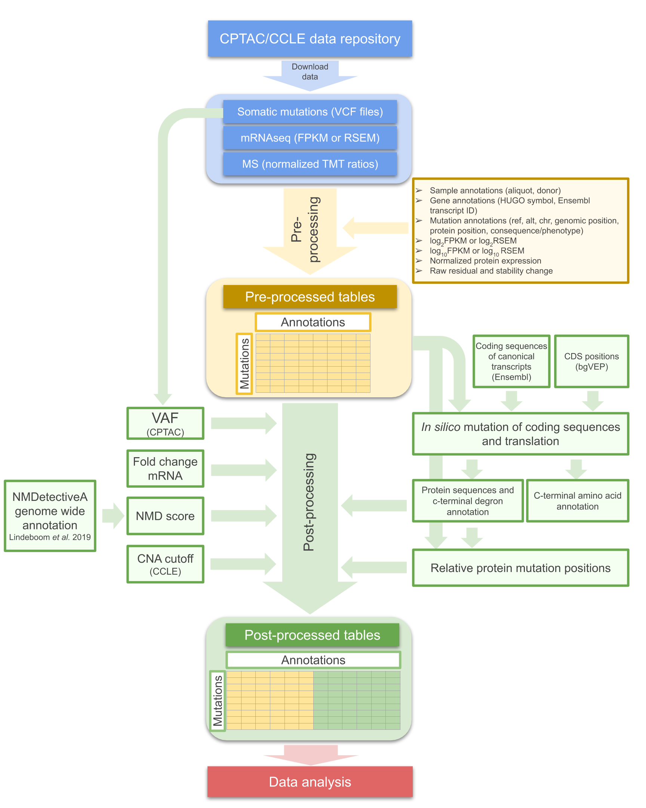

# Final Master Project

Master in Omics Data Analysis, Universitat de Vic (UVIC)

Necessary code to reproduce all the data from the final master project entitled as:\
*"The impact and function of c-terminal degrons and protein misfolding in the degradation of truncated proteins"*
<pre>
Student:        Mònica Sánchez Guixé
Supervisor:     Francisco Martínez Jiménez
Academic tutor: Josep Maria Serrat Jurado
Course:         2019/2020
</pre>

The following index indicates the correct order to reproduce all the results from post-processing (green) and data analysis (red): reading the pre-processed tables, obtaining and merging intermediate tables and compute the plots for the final report.

## Post-processing

### 1. VAF CPTAC table code
  >get_AF_VCF.sh

  Bash script to extract VAF from VCF files. It creates one tsv file per cancer type with the VAF (=AF) of each alterations
  
### 2. NMD score annotation
  >NMD_annotation/

  NMD score annotation is performed in 4 steps.
  
*  **2.1 NMD first preprocessing.txt**
  >NMD_bash_preprocessing.txt
  
  Preprocessing of NMD score tables (downloaded from https://figshare.com/articles/NMDetective/7803398) from NMDetectiveA files (hg38).
    
*  **2.2 NMD second preprocessing**
  >NMD_table_preprocessing.ipynb
  
  Prepare NMD score tables and CPTAC/CCLE with ns and fs genes tables for annotation.
    
*  **2.3 NMD-score annotation code**
  >NMD_table.py
  
  Python script for NMD score annotation. In this code we have to specify the rows of the NMD table that we want in each run. Avoid run all rows at once, as it highly increases the compilation time. Use qmap file to run per grouped rows.
    
*  **2.4 Qmap NMD-score annotation**
  >qmap_nmd_table.qmap
  
  Qmap file to run multiple NMD_table.py (per grouped rows). After all tables are compiled, we have to concatenate all tables in a single tsv table.
    
### 3. Mutation, translation and c-terminal degron/last-aa annotation code
  >Generation_ns_fs_mut_sequences.ipynb

  Notebook with the necessary code to generate mutated sequences, translation and c-terminal degron/amino acid annotation. It creates 2 tsv files (for each dataset): the first are protein sequences and c-terminal degron annotations, and the second is the c-terminal amino acid annotation.
  
### 4. Relative mutation position code
  >Relative mutation position analysis.ipynb

  Notebook with the necessary code to calculate the relative mutation position in the protein sequence. It creates one tsv file (for each dataset) with the relative mutation positions annotated.
  
### 5. CPTAC and CCLE data table preparation code
  >cptac_table.py

  Python script to prepare CPTAC and CCLE tables: 1) upload of pre-processed tables, 2) eliminate duplicated values, 3) add VAF (=AF) table (CPTAC dataset), 4) add NMD score table, 5) filter out CNA >=2 and <=2 (CCLE dataset), 6) calculate RNA fold change, 7) add c-terminal degron table, 8) add c-terminal amino acid table, 9) add relative mutation positions table and 10) annotate c-terminal degron alterations.
  
## Data analysis
  
### 6. Final report figures
  >Figures TFM.ipynb

  Notebook with the necessary code to reproduce all the plots and statistical analysis in the figures of the final report. Prepares the post-processed tables with the tables created in the post-processing steps.
